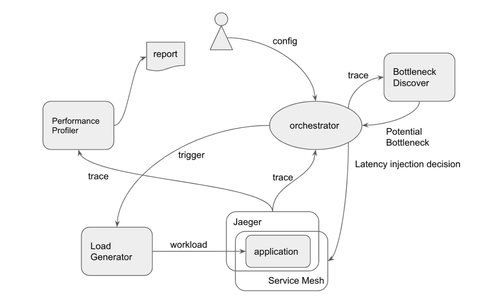

# EastTransitTenants

## Introduction
This project is a performance profiling and bottleneck analysis framework built on top of an open-source railway ticketingmicroservices system. From a big picture,our framework consists of five components:<br />
- 1)orchestrator:coordinate the interaction of other functional components;<br /><br />
- 2)load generator: generate workload for training and profiling purpose;<br /><br />
- 3)benchmark application:  an opensource railway ticketing microservices system which contains 41 mi-croservices and whose request can involve up to 200 spans (You can get more details at https://github.com/FudanSELab/train-ticket/wiki);<br /><br />
- 4)bottleneck discover: find all potential bottleneck services ina time-efficient way;<br /><br />
- 5)performance profiler: instrumentallyprofile how a service influencing the end-to-end performanceof the requests it belongs to.

## Architecture Graph


## Usage
First, build the framework with:
```go build```
<br /><br />
After built-up, you can choose either to train the bottleneck-discovery model or start the performance profiling and bottleneck analysis by run the project with different flags.
### Train Bottleneck-discovery Model
#### 1. Configuration for training
The input configurations are defined in ```train_config.json ```. We have provided a template configuration in ths file. You can modify it based on your application and request types.
```
{
    "request": [{
        "name": "search_tickets",
        "url": "http://35.231.88.215:32677/api/v1/travel2service/trips/left",
        "body": "{\"startingPlace\": \"Shang Hai\",\"endPlace\": \"Tai Yuan\",\"departureTime\": \"2020-12-21\"}"
    }],
    "bearer": "",
    "jaeger_ip": "35.231.88.215:32688",
    "workload": [1, 10, 25, 50, 100],
    "target_serv" : "ts-ui-dashboard.default"
}
```
- request: list of requests to generate training data. Each of them should contain the name of the request, the url of its API call, and the request body in json format
- bearer: authorization bearer token. Only provided if needed
- jaeger_ip: the IP address of Jaeger
- target_serv: the entrance service for all requests to your application, which is normally the front-end service.

#### 2. Train the model
```
go build
./easttransittenants -type=train
```

### Profile the Bottleneck
#### 1. Configuration for profiling
The configurations for profiling are defined in ```profile_config.json```.
```
{
    "jaeger_ip": "35.231.88.215:32688",
    "request": {
            "bearer": "",
            "name": "search_tickets",
            "url": "http://35.231.88.215:32677/api/v1/travel2service/trips/left",
            "body": "{\"startingPlace\": \"Shang Hai\",\"endPlace\": \"Tai Yuan\",\"departureTime\": \"2020-12-21\"}"
    },
    "workload": 10,
    "target_serv": "ts-travel2-service",
    "precision_ms": 25
}
```
- jaeger_ip: the address of the Jaeger deployment, used by our jaeger client to query trace data
- request: the target request to profile
- workload: target workload level
- target_serv: the entrance service for the request to the application
- precision_ms: desired precision of the bottleneck switching boundary in milliseconds

#### 2. Do Profile
```
go build
./easttransittenants -type=profile
```
